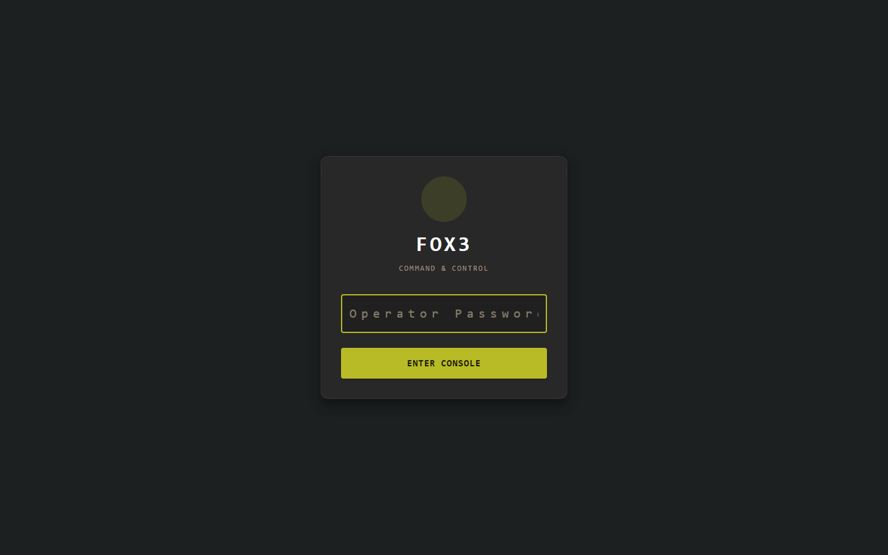
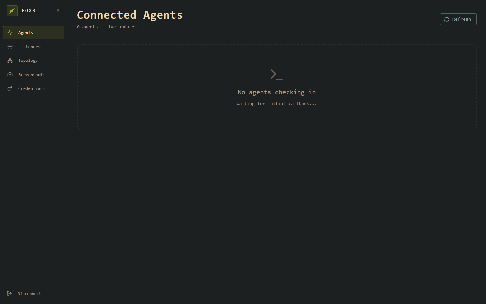
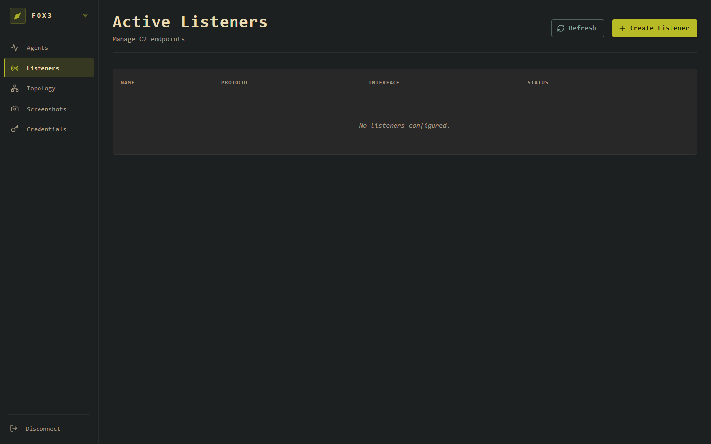
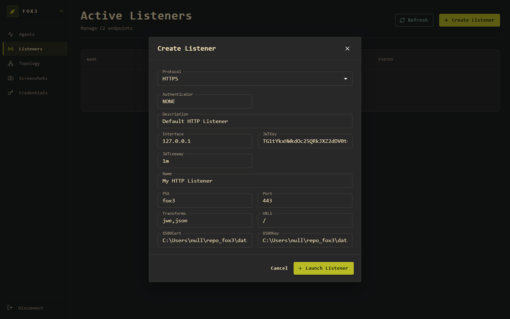
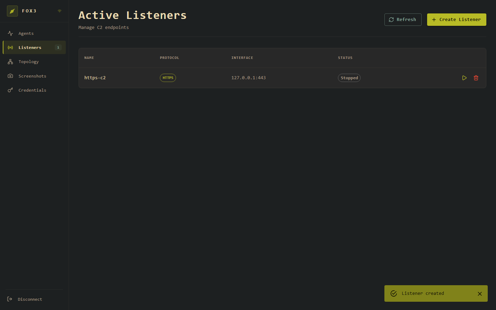
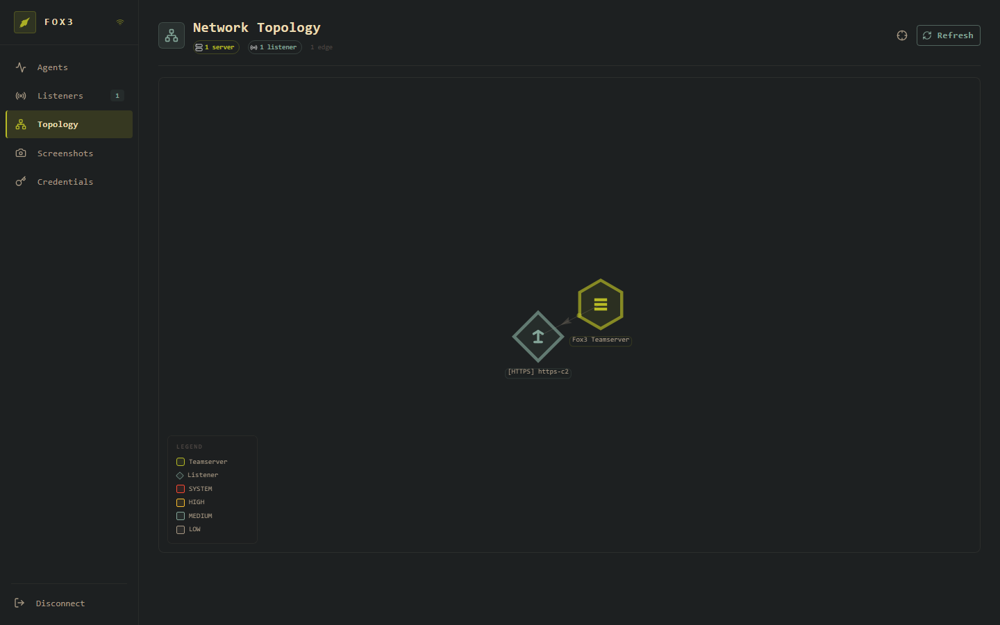
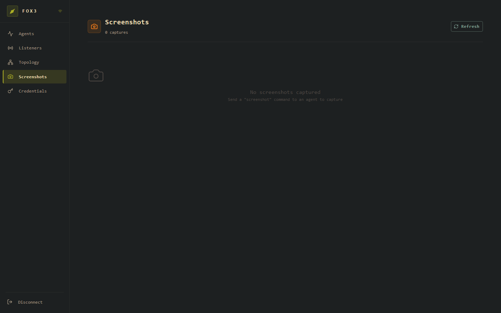
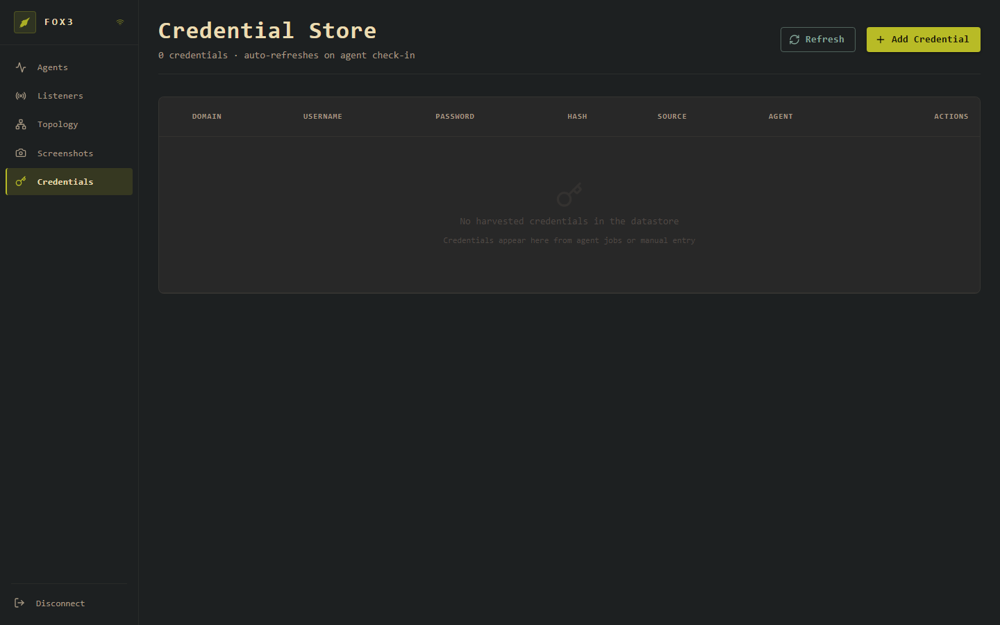

# Frontend Guide

The fox3 operator console is a React web app served at `http://<server>:8080`. All actions — creating listeners, tasking agents, reviewing job output — happen through this interface. There is no separate CLI.

---

## Starting the server

```bash
# Windows
go build -o fox3_server.exe .
.\fox3_server.exe --password <your-password>

# Linux
go build -o fox3_server .
./fox3_server --password <your-password>
```

The server prints its address on startup:

```
INFO Starting REST API server addr=0.0.0.0:8080
INFO API server listening on 0.0.0.0:8080 (WS-only)
```

Open `http://localhost:8080` in a browser.

> For remote access, proxy port 8080 behind nginx/Caddy with TLS. The operator console itself does not require HTTPS — that is for the **agent listener**, configured separately.

---

## Login



Enter the password you passed with `--password` (default: `fox3`). The server issues a 24-hour JWT on success. The console uses this token for all subsequent WebSocket communication.

**Rate limiting:** After 5 consecutive wrong passwords from the same IP, the login endpoint locks that IP out for 15 minutes.

---

## Navigation

After login the left sidebar is your primary navigation:

| Item | Description |
|---|---|
| **Agents** | Connected agents — the main workspace |
| **Listeners** | C2 endpoints that agents call back to |
| **Topology** | Live network graph of server → listeners → agents |
| **Screenshots** | Agent desktop captures |
| **Credentials** | Harvested credential store |
| **Disconnect** | Logs out and returns to the login screen |

Numeric badges on sidebar items show live counts (e.g. "Listeners **1**").

---

## Agents



The **Connected Agents** view is the main workspace. It shows every agent that has ever checked in with a live status. The subtitle shows "live updates" — the count and agent cards refresh automatically via WebSocket push whenever an agent checks in; you do not need to click Refresh.

**Agent status colours**

| Status | Meaning |
|---|---|
| Active | Checked in within one sleep period |
| Delayed | Between 1× and 3× the sleep interval since last checkin |
| Dead | More than 3× the sleep interval — likely lost |

**When an agent connects**, its card appears immediately showing hostname, username, process, platform, integrity level, and last check-in time. Click the card to open the agent detail view with a command terminal.

### Agent detail / terminal

The agent detail view (click any agent card) contains:

- **Info panel** — hostname, username, PID, platform/architecture, sleep interval, integrity
- **Command terminal** — type any command from [commands.md](commands.md) and press Enter; output appears when the agent checks in on its next sleep cycle
- **Jobs table** — all pending and completed jobs with status and output
- **Note field** — free-text annotation attached to the agent

**Example session:**

```
> whoami
CORP\administrator

> ls C:\Users
.  ..  Administrator  Public  victim

> sleep 10s
sleep updated to 10s
```

---

## Listeners



**Active Listeners** shows every listener currently in memory. Listeners are the C2 endpoints your agents call back to. They are in-memory only — they do not survive a server restart.

The table columns are:

| Column | Description |
|---|---|
| **Name** | The label you gave the listener |
| **Protocol** | Badge showing the transport (HTTPS, HTTP, etc.) |
| **Interface** | Bind address and port (e.g. `0.0.0.0:443`) |
| **Status** | `Active` or `Stopped` |
| ▶ | Start a stopped listener |
| 🗑 | Delete the listener (stops it first) |

### Creating a listener

Click **+ Create Listener** to open the creation dialog.



**Fields:**

| Field | Default | Description |
|---|---|---|
| Protocol | HTTPS | Transport type. Choose `HTTPS` for production, `HTTP` for local testing |
| Authenticator | NONE | `NONE` (PSK only) or `OPAQUE` (strong authentication) |
| Description | Default HTTP Listener | Free text label |
| Interface | 127.0.0.1 | IP address to bind. Use `0.0.0.0` to listen on all interfaces |
| JWTKey | _(auto-generated)_ | Base64-encoded signing key for agent session JWTs. Leave blank to auto-generate |
| JWTLeeway | 1m | Clock-skew tolerance for JWT expiry validation |
| Name | My HTTP Listener | Display name shown in the table |
| PSK | fox3 | Pre-shared key. **Change this.** The agent must be compiled with the matching PSK |
| Port | 443 | TCP port to bind |
| Transforms | jwe,json | Encode/encrypt pipeline. Must match the agent's compiled pipeline |
| URLS | / | URL paths the agent handler mounts on |
| X509Cert | _(auto path)_ | Path to PEM certificate (HTTPS/HTTP2/HTTP3 only) |
| X509Key | _(auto path)_ | Path to PEM private key (HTTPS/HTTP2/HTTP3 only) |

Click **+ Launch Listener** to create it. A "Listener created" toast confirms success and the row appears in the table immediately.



The listener is created in **Stopped** state. Click ▶ in the row to start it — it will then begin accepting agent connections.

### Quick start: HTTPS listener for production

Before creating the listener, generate a certificate:

```bash
# Self-signed (testing)
mkdir -p data/x509
openssl req -x509 -newkey rsa:4096 -keyout data/x509/server.key \
  -out data/x509/server.crt -days 365 -nodes -subj "/CN=your.domain.com"
```

In the Create Listener dialog:
- **Protocol**: HTTPS
- **Interface**: 0.0.0.0
- **Port**: 443
- **PSK**: *(strong random string — must match agent compile-time PSK)*
- **X509Cert**: `data/x509/server.crt`
- **X509Key**: `data/x509/server.key`

Click **+ Launch Listener**, then ▶ to start it.

---

## Topology



The **Network Topology** view renders the infrastructure as a live graph:

| Shape | Represents |
|---|---|
| Hexagon | Fox3 Teamserver |
| Diamond | Listener |
| Square (red) | Agent — SYSTEM integrity |
| Square (orange) | Agent — HIGH integrity |
| Square (grey) | Agent — MEDIUM or LOW integrity |

Edges connect teamserver → listener → agent, and agent → pivot agent for chained deployments. The badge strip at the top ("1 server · 1 listener · N agents") updates in real time.

Click any node to see its label and details.

---

## Screenshots



Screenshots are taken by sending the `screenshot` command to an agent from the agent terminal:

```
> screenshot
```

The agent captures the screen on its next check-in and returns the data to the server. It appears in the gallery immediately. Click any thumbnail to view full-size. Each entry shows the agent UUID, timestamp, and an optional note.

---

## Credentials



The **Credential Store** collects credentials from:
- Agent jobs that return credential data (e.g. mimikatz output processed by the agent)
- Manual entry via **+ Add Credential**

The table shows DOMAIN, USERNAME, PASSWORD, HASH, SOURCE, and the AGENT that retrieved them. Credentials persist in SQLite across server restarts.

**Manually adding a credential:**

Click **+ Add Credential** and fill in any fields that are known (hash alone, or full plaintext, etc.). The source field is freetext — use it to note the technique (`secretsdump`, `kerberoast`, `lsass`, etc.).

---

## WebSocket connectivity indicator

The WiFi icon in the top-left header shows WebSocket connection state:

- **Solid** — connected, receiving live updates
- **Faded/animated** — reconnecting

If the icon shows disconnected, the browser has lost the WebSocket session (server restart, network blip). The app will attempt to reconnect automatically. If it does not, click **Disconnect** and log in again.

---

## Workflow: from zero to first agent

1. **Start the server**
   ```bash
   ./fox3_server --password <pw>
   ```

2. **Log in** at `http://localhost:8080`

3. **Create a listener** (Listeners → + Create Listener)
   - Set Interface to `0.0.0.0`, Port to `443`, PSK to your chosen key
   - For HTTPS: provide cert/key paths
   - Click Launch Listener, then ▶ Start

4. **Build the agent** with matching PSK and server address
   - See [fox3_agent](https://github.com/nzyuko/fox3_agent) for agent build instructions
   - The agent's `C2_URL`, `PSK`, and `Transforms` must match the listener

5. **Deploy the agent** to the target

6. **Wait for callback** — the Agents page will show the agent card the moment it checks in, with no manual refresh needed

7. **Task the agent** — click the agent card, type commands in the terminal

---

## Keyboard shortcuts

| Key | Action |
|---|---|
| Enter | Submit command in agent terminal |
| ↑ / ↓ | Navigate command history in terminal |
| Esc | Close modal dialogs |
